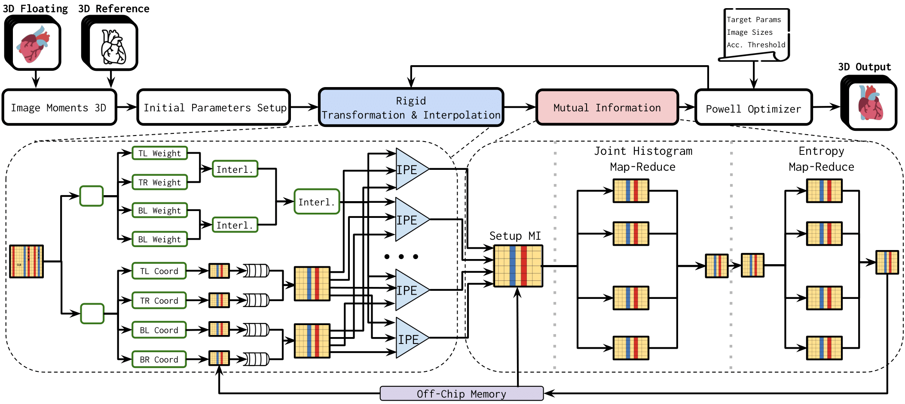

# Soaring with TRILLI: an HW/SW Heterogeneous Accelerator for Multi-Modal Image Registration

TRILLI is a novel Versal-based accelerator for **3D rigid image registration**.
TRILLI is designed to address the computational challenges in both key components of the registration process, **geometric transformation with interpolation** and **similarity metric** computation, by optimally mapping computational steps to heterogeneous hardware components on the [Versal VCK5000](https://japan.xilinx.com/content/dam/xilinx/publications/product-briefs/amd-xilinx-vck5000-product-brief.pdf).

## System architecture

*System Architecture Diagram: TRILLI integration with a CPU-based Powell optimizer for multi-modal 3D rigid image registration. Input images are used for an initial transformation and accelerated registration via TRILLI. The resulting MI is used by the Powell optimizer
to iteratively refine transformation parameters based on user-defined settings. The final output is a registered floating volume.*

## Requirements
- Hardware Device: Versal VCK5000 XDMA2022.1
- Vitis 2022.1 
- XRT 2022.1
- OpenCV 3.0.0 - static library
- Python 3.8
- GCC 7.3.1

## Code overview
- `3DIRG_application/`: complete registration framework
- `aie/`: AI Engines source code
- `common/`: constants and configuration generator
- `data_movers/`: PL kernels source code
- `hw/`: system integration and output bitstream
- `mutual_info/`: PL mutual information kernel source code from **[Hephaestus](https://dl.acm.org/doi/10.1145/3607928)**
- `soa/`: GPU 3D Image Registration from athena, with scripts for simplifying testing
- `sw/`: host source code
- `default.cfg`: architecture configuration parameters

## FCCM25 Artifact Evaluation
For artifact evaluation, see the [AE.md](./AE.md) file.

<!-- Following we describe three testing flows: 

- Case 1: using the given bitstream to test image transformation and/or image registration step
- Case 2: building from scratch the desired bitstream for image transformation and/or image registration step
- Case 3: target the whole image registration application. This can be done either using the given bitstream for image registration step, or building it from scratch

### Case 1. Using given bitstreams for Image Transformation or Image Registration Step
*Available bitstreams*:
- `bitstreams/OnlyTX_32IPE.xclbin` for the image transformation only (**TX**)
- `bitstreams/RegStep_32IPE.xclbin` for the image registration step and complete application (**STEP**)

The file `bitstreams/config_DIM512_IPE32.cfg` contains the configuration used to build the bitstreams.

#### Flow
1. Source Vitis & XRT
    ```bash
    source <YOUR_PATH_TO_XRT>/setup.sh
    source <YOUR_PATH_TO_VITIS>/2022.1/settings64.sh
    ```
2. Move into the root folder of this repository & build the transformation standalone bitstream
    ```bash
    cd <your-path>/trilli
    ```
3. Load the configuration used to build the bitstreams
    ```bash
    make config CFG=bitstreams/config_DIM512_IPE32.cfg
    ```
4. Compile the host code
    ```bash
    make build_sw TASK=[TX|STEP]
    ```
5. Pack the build into a single folder, ready for testing
    ```bash
    make pack XCLBIN=<xclbin-path> [NAME=<name>]
    ```
    This command generates the folder `build/<name>` (default name is `hw_build`) which will contain the bitstream `<xclbin-path>` (i.e. `bitstreams/OnlyTX_32IPE.xclbin`), the host executable and the dataset.
6. Move the generated folder `build/<name>` (i.e. `cd build/hw_build`) to the deploy machine
7. On the deploy machine, generate the dataset with `./generate_dataset.sh [dim] [depth]`. Considering the parameters used for the paper, the command is:
    ```bash
    ./generate_dataset.sh 512 256
    ```
8. Source XRT on the deploy machine
    ```bash
    source <YOUR_PATH_TO_XRT>/setup.sh
    ```
9. Run on the deploy machine with: `./host_overlay.exe [depth] [x] [y] [ang_degrees] [num_runs]`. Considering the parameters used for the paper, the command is: ***TODO fill in parameters***
    ```bash
    ./host_overlay.exe 512 18.54458648 -12.30391042 20.0 1
    ```
---- -->

## Building

Two different designs are available for building:
- **TX** - Geometric transformation with interpolation
- **STEP** - Image registration step (geometric transformation + mutual information computation)

Moreover, design parameters can be set in the `default.cfg` file as described in the following sections.

### Flow

1. Source Vitis & XRT
    ```bash
    source <YOUR_PATH_TO_XRT>/setup.sh
    source <YOUR_PATH_TO_VITIS>/2022.1/settings64.sh
    ```
2. Move into the root folder of this repository & build the transformation standalone bitstream
    ```bash
    cd <your-path>/trilli
    ```
3. Edit the `default.cfg` file to detail the configuration desired. 

    *For Transformation, relevant parameters are:*
    - `DIMENSION := ...` - represents the image resolution DIMENSION x DIMENSION. Choices = [1,2,4,8,16]
    - `INT_PE := ...` - Number of Interpolation Processing Elements. Choices: [1,2,4,8,16,32]
    - `PIXELS_PER_READ := ...` - represents the port width. [32,64,128]

    *For the rigid step, instead:*
    - `DIMENSION := ...` - represents the image resolution DIMENSION x DIMENSION, 512 for the paper
    - `HIST_PE := ...` - Histogram Processing elements for Mutual Information. Choices = [1,2,4,8,16]
    - `EPE_PE := ...` - Histogram Processing elements for Mutual Information. Choices = [1,2,4,8,16]
    - `INT_PE := ...` - Number of Interpolation Processing Elements. Choices: [1,2,4,8,16,32]
    - `PIXELS_PER_READ := ...` - represents the port width. Choices: [32,64,128]

4. Prepare the folder to be moved on the deploy machine (default name is `hw_build`).
    ```bash
    make build_and_pack TARGET=hw TASK=[TX|STEP] NAME=[NAME=<name>]
    ```
5. Move the generated folder, `build/NAME` (i.e. `cd build/hw_build`), to the deploy machine.
6. Follow the instructions in the [next section](#running) to run the application on the deploy machine.

## Running
***Note: the following operations must be performed on the deploy machine (where the `build/NAME` folder has been moved).***

1. Generate the dataset with `./generate_dataset.sh [dim] [depth]`
    ```bash
    ./generate_dataset.sh 512 246
    ```
2. Source XRT
    ```bash
    source <YOUR_PATH_TO_XRT>/setup.sh
    ```
3. Run the application with `./host_overlay.exe [depth] [x] [y] [ang_degrees] [num_runs]`
    ```bash
    ./host_overlay.exe 512 18.54 -12.31 20.0 1
    ```

## Complete image registration application 

1. Build the single registration step (**STEP**) by following the [building](#building) instructions and selecting `TASK=STEP`.
2. Compile the software application. We remind the hard requirements of OpenCV 3.0.0 installed and statically compiled.
    ```bash
    make build_app
    ```
3. If available, move the CT volume in `3DIRG_application/PET_small/png` and the PET volume in `3DIRG_application/CT_small/png`. Alternatively, skip this step: a different dataset can be generated later on the deploy machine.
4. Prepare the folder (default name is `hw_build`).
    ```bash
    make pack_app [NAME=<name>]
    ```
5. Move the generated folder, `build/NAME` (i.e. `cd build/hw_build`), to the deploy machine.
6. If necessary, generate the dataset.
    ```bash
    ./generate_dataset.sh
    ```
5. Execute the application: 
    ```bash
    ./exec.sh 
    ```

## Plotting Paper Figures
To plot each result figure in the paper, please refer to the corresponding folder under **paper_fig/.**
Each folder contains a subfolder with the figure name, and a dedicated readme for running. Per each figure, we provide some dedicated .csv files, containing sufficient numbers to replicate the paper result.


## Related Publications/Repository for Literature Comparison

- **[Hephaestus](https://dl.acm.org/doi/10.1145/3607928)** - Mutual Information & CPU-FPGA 3D image registration 
- **[Athena](https://doi.org/10.1109/BioCAS58349.2023.10388589)** - GPU-based 3D image registration
- **[Vitis Libraries](https://github.com/Xilinx/Vitis_Libraries/tree/2022.1)** - WarpAffine3D kernel for image transformation
- **[ITK](https://github.com/InsightSoftwareConsortium/ITK/)** powell-based 3D image registration
- **[SimpleITK](https://github.com/SimpleITK/SimpleITK)** powell-based 3D image registration

## Paper Citation

If you find this repository useful, please use the following citation:

```latex
@inproceedings{sorrentino2025trilli,
    title = {Soaring with TRILLI: an HW/SW Heterogeneous Accelerator for Multi-Modal Image Registration},
    author = {Giuseppe, Sorrentino and Paolo S., Galfano and Eleonora, D'Arnese and Davide, Conficconi},
    year = 2025,
    booktitle={2025 IEEE 33rd Annual International Symposium on Field-Programmable Custom Computing Machines (FCCM)},
    organization={IEEE}
 } 
```
